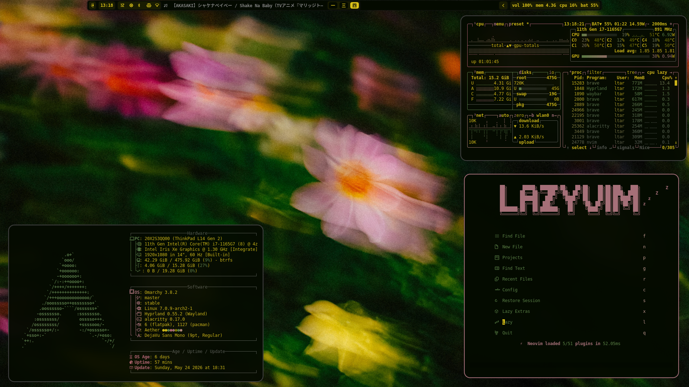

# Green Flower
A calm, nature-inspired theme blending deep greens with warm floral tones.
Inspired by tranquility and elegance, built for a minimal and distraction-free experience.
Perfectly suited to the omarchy.org aesthetic — subtle, beautiful, and refined.

## Features
- 🌸 Floral wallpaper
- ✨ Smooth fade animation between workspaces
- 🔲 Rounded corners




## Installation
```bash
omarchy-theme-install https://github.com/LATAR-web/green-flower.git
```

## Credits
- Waybar theme by [HANCORE-linux](https://github.com/HANCORE-linux/waybar-themes)


### License
MIT
